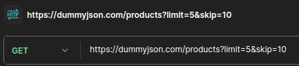
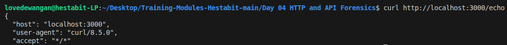
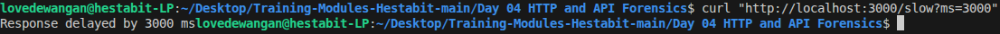
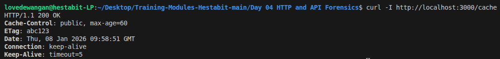

# Day - 4 API Investigation Report
 
**Name:** Love Dewangan  
**Email:** love.dewangan@hestabit.in

---

## Aim

This lab explored HTTP fundamentals through practical API testing. I used curl for command-line requests, analyzed caching mechanisms, manipulated headers, and built a simple Node server to understand the request-response cycle.

---

## 1. Network Diagnostics

### DNS Lookup
nslookup dummyjson.com

This queries the DNS to resolve the domain IP address also this shows which DNS server answered.

### Traceroute
traceroute dummyjson.com

This shows network hops between you and server also it identifies latency and routing issues.
It basically helps to detech network bottlenecks and proxies.

---

## 2. Testing with CURL

### Basic Request with Pagination

curl -v https://dummyjson.com/products?limit=5&skip=10

`-v` - verbose shoes the headers, TLS and requests

**About Pagination**
`limit=5` - This tells the API to only return 5 products.
`skip=10` - This tells the API to skip the first 10 products

---

## 3. Header Experiments

### Removing User-Agent
curl -v -H "User-Agent:" https://dummyjson.com/products

Here I explicitly send an empty User-Agent and the Server still responded DummyJSON didn't care and gave the permission.
Some APIs usually block requests without User-Agent to stop bots.

### Fake Authorization Header
curl -v -H "Authorization: Bearer fake-token-12345" https://dummyjson.com/products

I sent a fake Bearer token. Since this endpoint is public, nothing happened. But protected endpoints would've rejected it with a 401 Unauthorized. Real APIs check if tokens are valid and not expired.

**Difference:** Public endpoints ignore auth headers, but protected ones validate them before processing the request.

---

## 4. Caching with ETags

### First Request

curl -I https://dummyjson.com/products

The response included an ETag header:

ETag: "W/"ac3a-uk0FDUI0X0lS5liyUbIxqA7L7F4"

### Conditional Request
curl -v \
-H 'If-None-Match: W/"ac3a-uk0FDUI0X0lS5liyUbIxqA7L7F4"' \
https://dummyjson.com/products

I sent the ETag back in an `If-None-Match` header. The server checked if the content changed:
- **If unchanged:** Returns `304 Not Modified` with no body (just headers)
- **If changed:** Returns `200 OK` with the new content

This saves tons of bandwidth. A 304 response might be 200 bytes instead of 5KB for the full JSON.

---

## 5. Node HTTP server with endpoints

I built a simple HTTP server with three endpoints:

### `/echo` - Header Inspector

**Purpose:** Debug what headers the client is actually sending. Useful when testing if proxies or load balancers are modifying headers.

Tested it:
curl http://localhost:3000/echo

### `/slow` - Latency Simulator

**Purpose:** Test timeout handling and loading states in frontend apps.

Tested it:
curl http://localhost:3000/slow?ms=3000

This helped me understand how real APIs might have slow database queries or external API calls.

### `/cache` - Cache Headers

**Purpose:** Show how servers tell clients to cache responses.

Tested it:
curl -I http://localhost:3000/cache

---

## 6. Observations

### Pagination
Loading all products at once would kill performance. That's why pagination exists:
- Reduces network load
- Saves memory on the client
- Users rarely need everything at once

I noticed offset-based pagination (`skip/limit`) can cause issues. If data changes while you're browsing pages, you might see duplicates or skip items. 

### Caching Layers
The ETag test revealed caching happens at multiple levels:
- Browser cache (local storage)
- CDN cache (Cloudflare, Akamai)
- Application cache (Redis, Memcached)
- Database query cache

Each layer reduces load on the next one. A 304 response with ETag saved bandwidth by not resending unchanged data.

