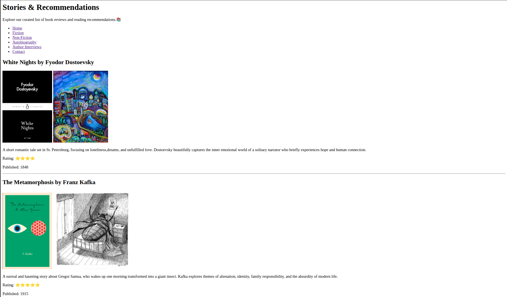
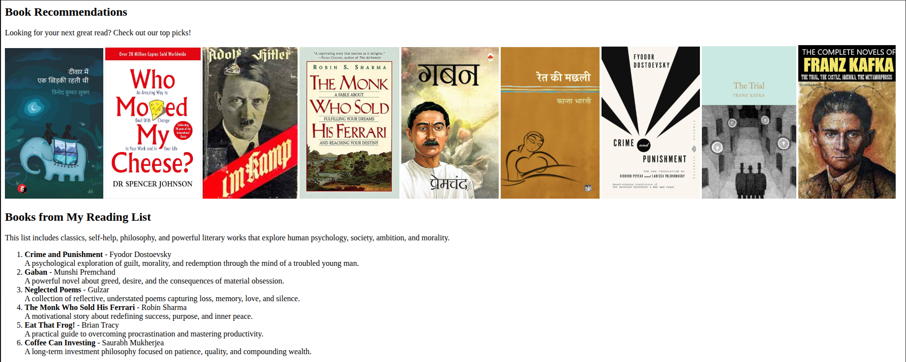
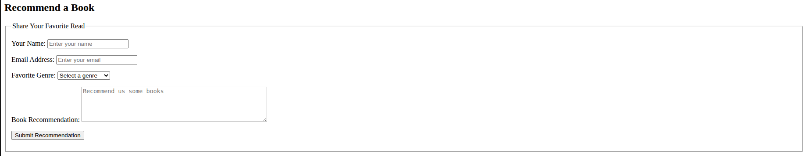
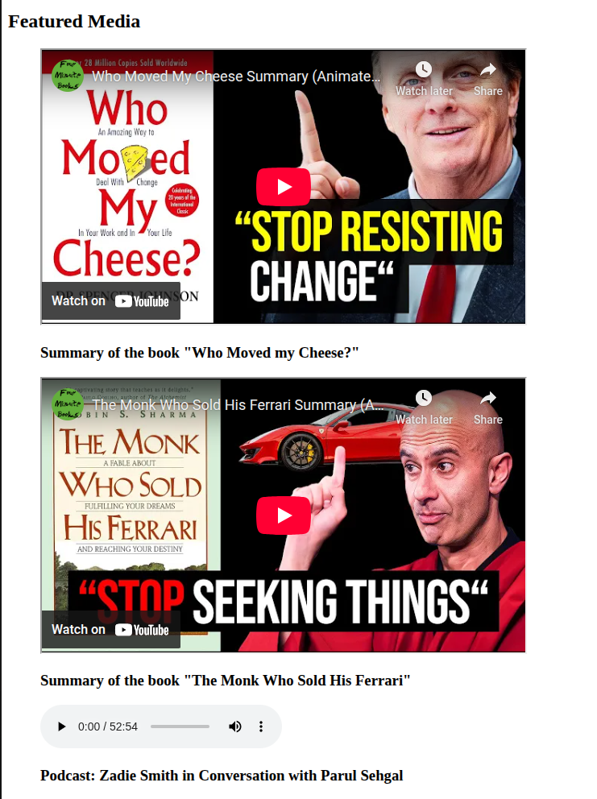

## Week 2 (Day 1) - HTML5 and Semantic Layout

**Name: Love Dewangan**  
**Email: love.dewangan@hestabit.in**

# Task -

Build a Blog Page using only semantic HTML, no CSS

# Outcome

## What I Built

Built a Book Blog

A simple book blog, with no css only created the structure of the webpage through HTML5 focusing on accessibility.

## Learnings and Observation

### HTML Structure

I learned about the HTML tags and why its neccessary at a specific given place like:

- `<nav>` - when we have to group major navigation links
- ` <header>``<footer> ` - every webpage is required to have these tags to maintain structure and layout
- `<section>` to group related content around a theme.
- `<article>` to represent content that can stand on its own
- `<figure>` to wrap media elements properly

### How Forms actually works

Built a complete Book recommendation form with:

- Name and email inputs with validation
- Genre dropdown selector
- Textarea for detailed Book recommendations by user.
- Required field validation
- `<fieldset>` to separate this form section from others

### Media Integration

Embedded different types of media:

- YouTube videos through `<iframes>` for book summary videos
- HTML5 audio player for a literary podcast
- Multiple images

### Accessibility Features

I learnt the importance for these features which I used to previously avoid

- ARIA labels on navigation (`aria-label="Main Navigation"`)
- Descriptive alt text on all images
- Semantic form structure with proper labels
- Placeholder to specify the form fields

## Overall Learning

Building this blog without CSS was harder than expected,I kept wanting to add styling But that's exactly what made it valuable.

I realized that proper HTML structure isn't just prep work for CSS. The semantic tags make the page readable and functional on their own. When you can't hide behind styling, you're forced to get the markup right.

The accessibility features I used to skip (ARIA labels, alt text) suddenly made a lot more sense. Without visual cues, they become essential, not optional.
