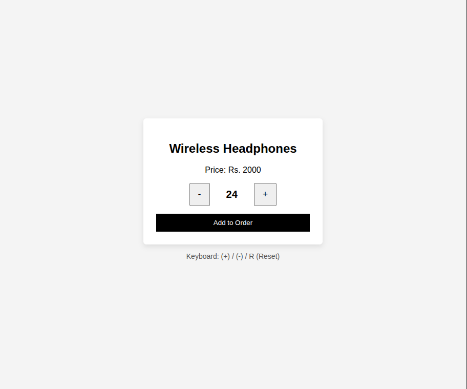
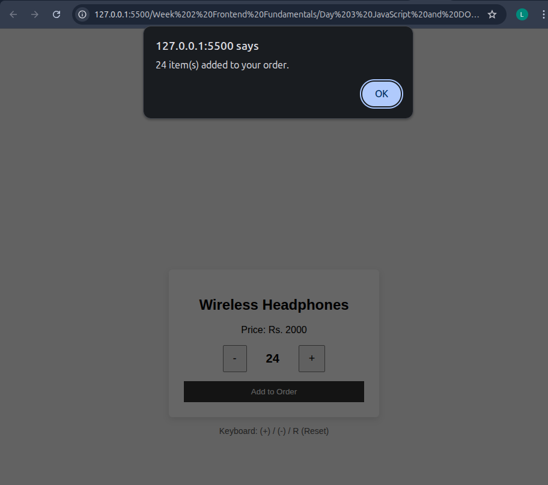
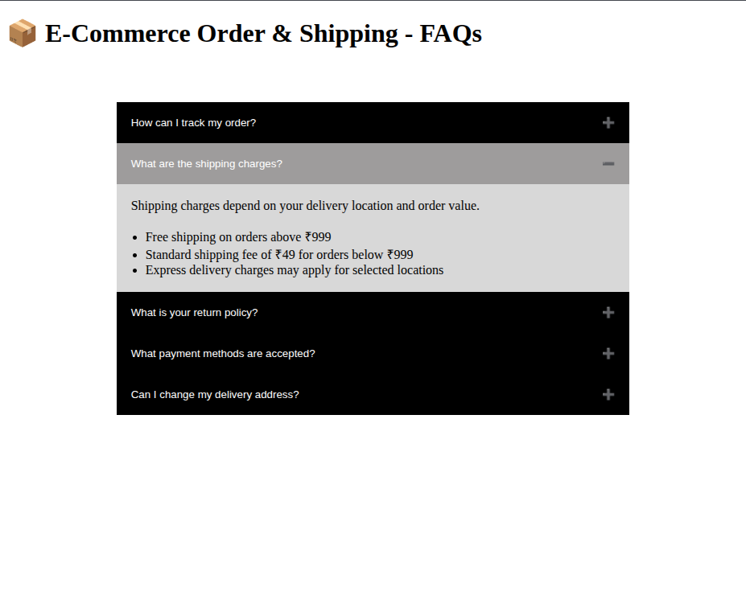

## Week 2 (Day 3) - JavaScript ES6 and DOM Manipulation

**Name: Love Dewangan**  
**Email: love.dewangan@hestabit.in**

## Task

Build an interactive FAQ accordion using JS (click to expand)

Also practice DOM manipulation and Event listeners.

## Additional Challenge

To close other opened FAQs when another opens.

For this I removed the accordion from active state also made the other visible panel hidden.

## Practice

Event listeners(counter and key events)

## Task Outcomes

