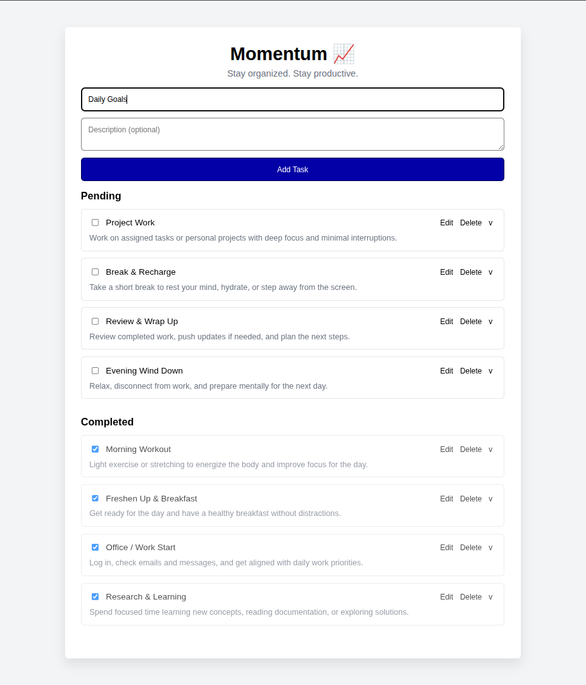
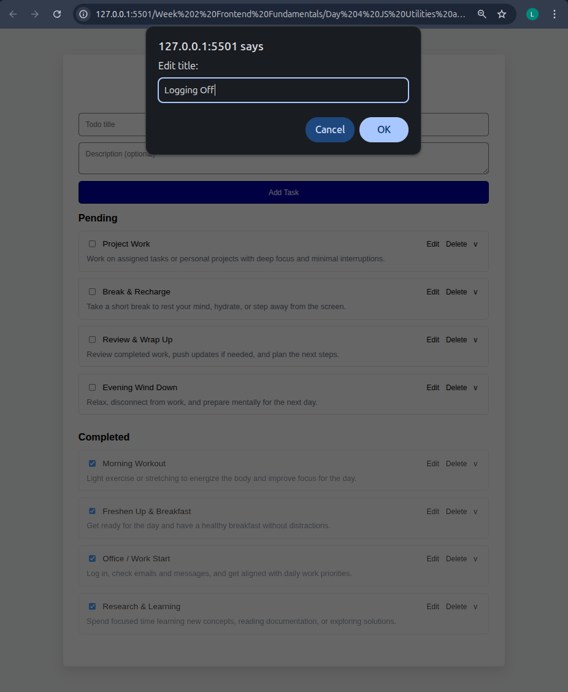
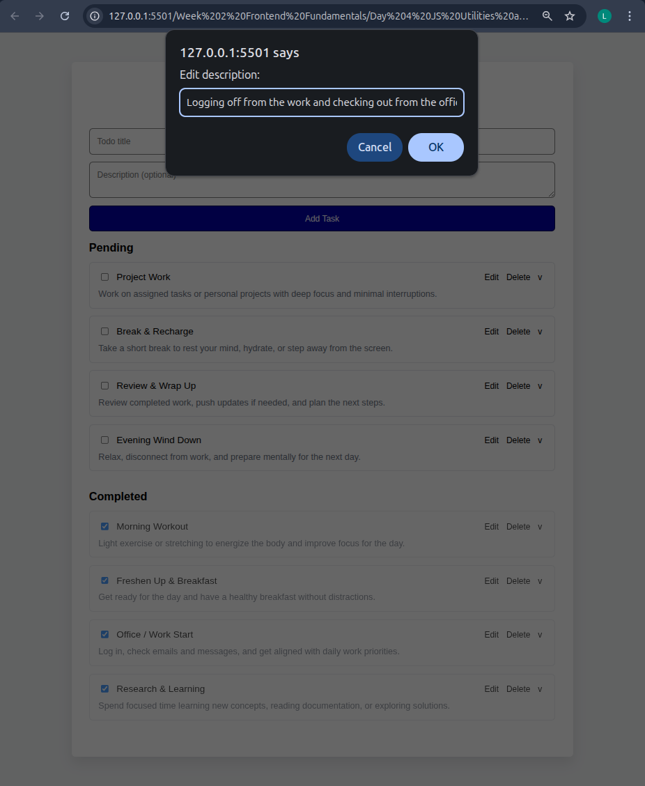
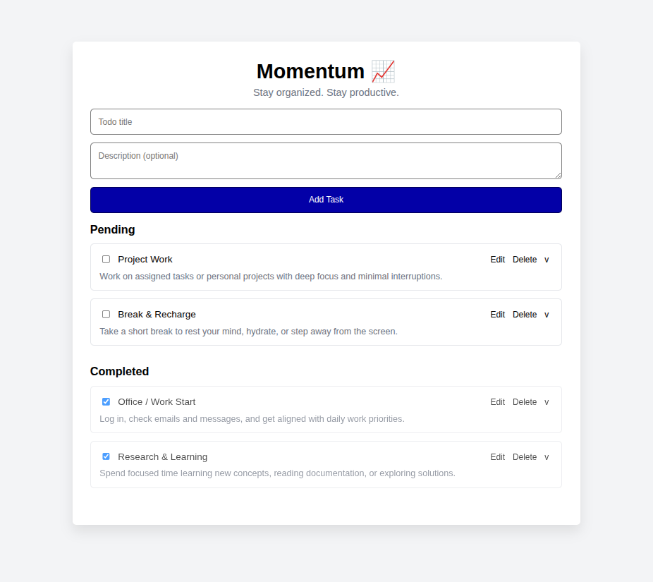

## Week 2 (Day 4) - JS Utilities and LocalStorage Mini-Project

**Name: Love Dewangan**  
**Email: love.dewangan@hestabit.in**

## Task

Build Todo App with LocalStorage persistence.
(Add → Edit → Delete → Persist after refresh)

## Additional Challenge

Added a Task Completed and Task Pending Section where user can check the tasks which are completed.
Apart from this I also added a Description section of the Todo Task which is also editable.

## (Add → Edit → Delete → Persist after refresh)

Adding Tasks

Editing Tasks

Deleting Tasks

## Task Outcomes

