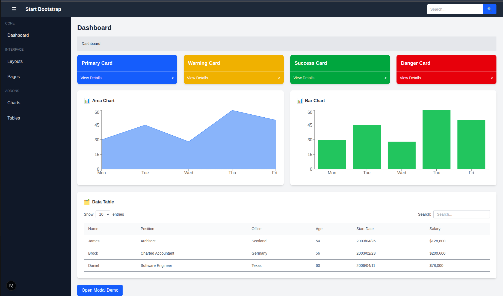
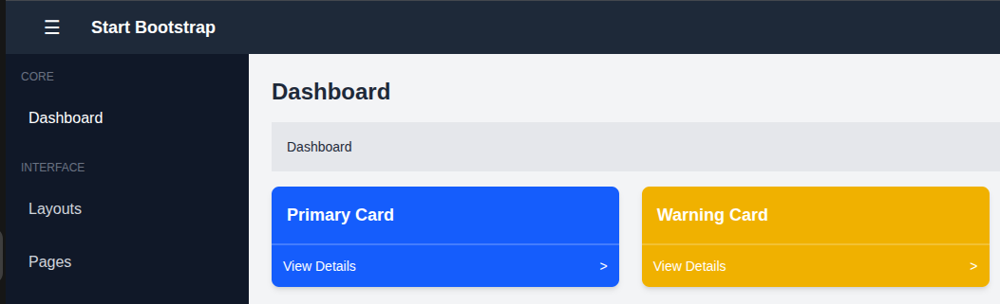
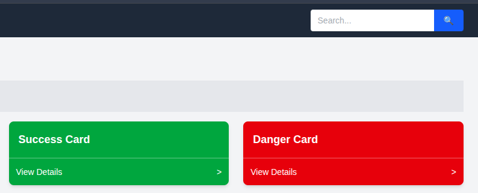
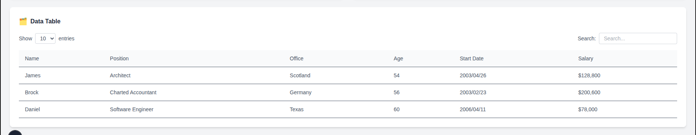
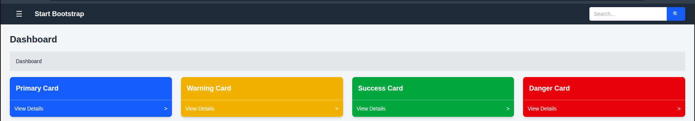
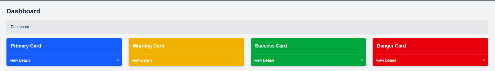
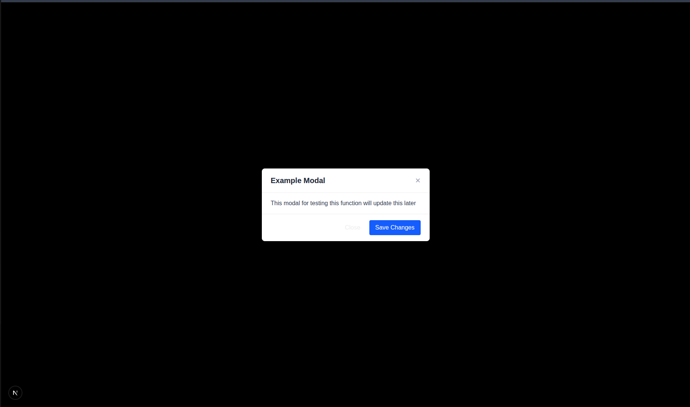

## Week 3 (Day 2) - Tailwind Advanced and Component Library

**Name: Love Dewangan**  
**Email: love.dewangan@hestabit.in**

## Task

Build the full layout using reusable components, reusing the Day-1 UI component sidebar and header.

## Final Output

## Usage Example

**Button.jsx**
This I reused in my dashboard for Hamburger Button, and Search Button for the Navbar and Data Table. Further it can be used in many different places where button is required as I have a default css for button that can go with any button.

Hamburger Button

Search Button

**Input.jsx**
This I reused in my dashboard for the Navbar search Input and Data Table Search Input. Apart from this I have created a default setting for the Input field which can be further reused whenever required.

Input

**Card.jsx**
This I reused in my dashboard for the Grid card which are present in the dashboard.

Grid

**Modal.jsx**
This I reused to creating I modal pop-up which is currently just for testing.

Modal

