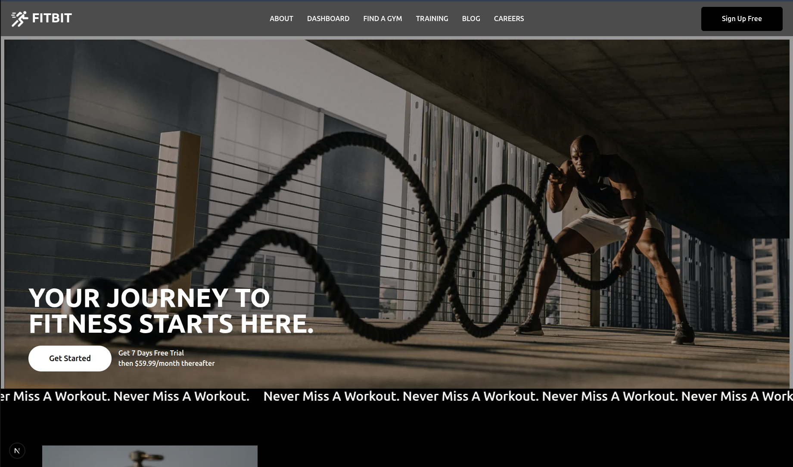
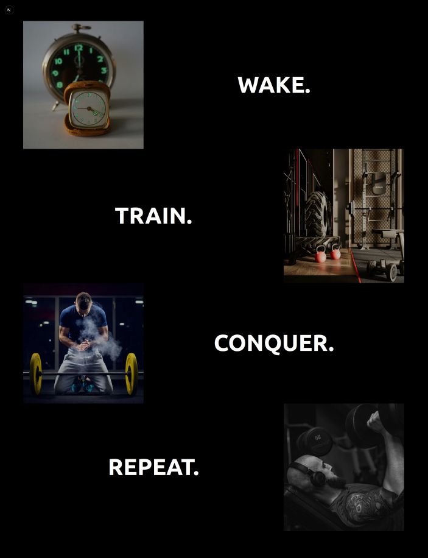
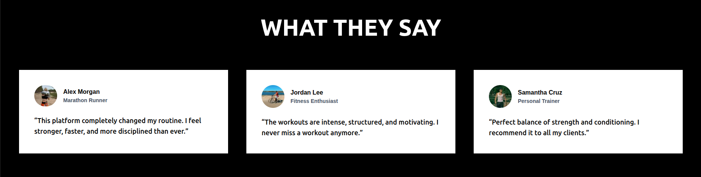
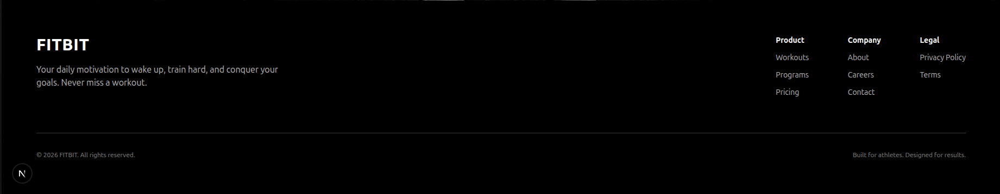

## Week 3 (Day 4) - Dynamic UI and Image Optimization

**Name: Love Dewangan**  
**Email: love.dewangan@hestabit.in**

## Task

Build a responsive landing page (like SaaS product page)

## Final Output

## Learning and Outcomes

**Image Component and props**
Here for landing page everywhere for images I used Image Component. Due to which I could see that the webpage was loading faster and my entire page was optimized.

**Main Section**
Here for this I used flex property of css to arrange the images in this style further on I am going to route it for Day 5's task.

**Testimonials Cards**
Here I created a component testimonial and routed it to the main page.

**Footer**
Here I created a component footer which I routed it to main page.

**Responsive View**
I made the landing page responsive through changing the scale also the layout element like padding, margin etc with the breakpoints.

