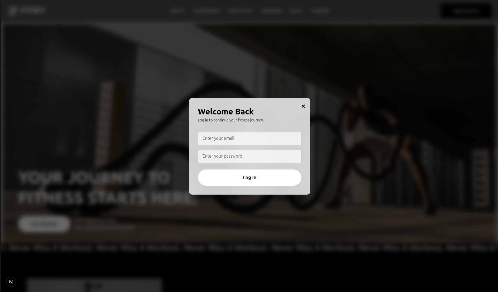
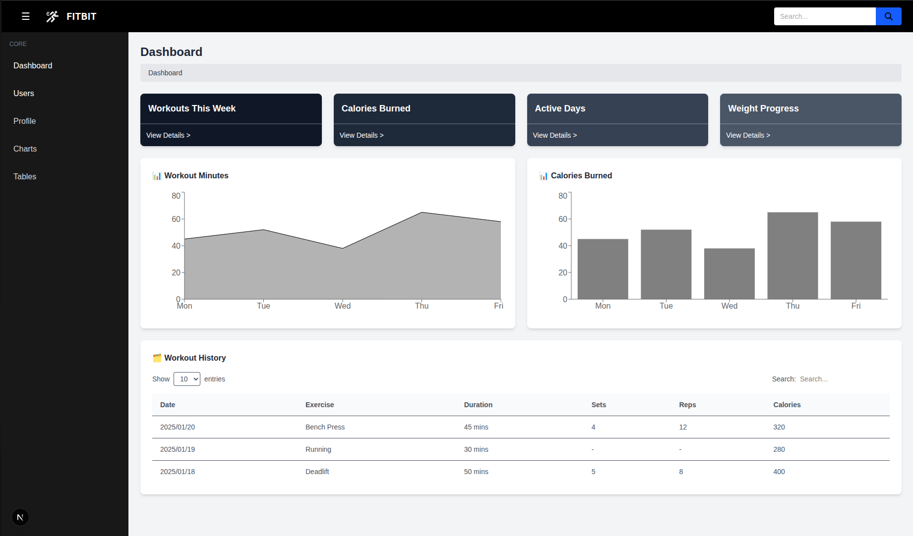
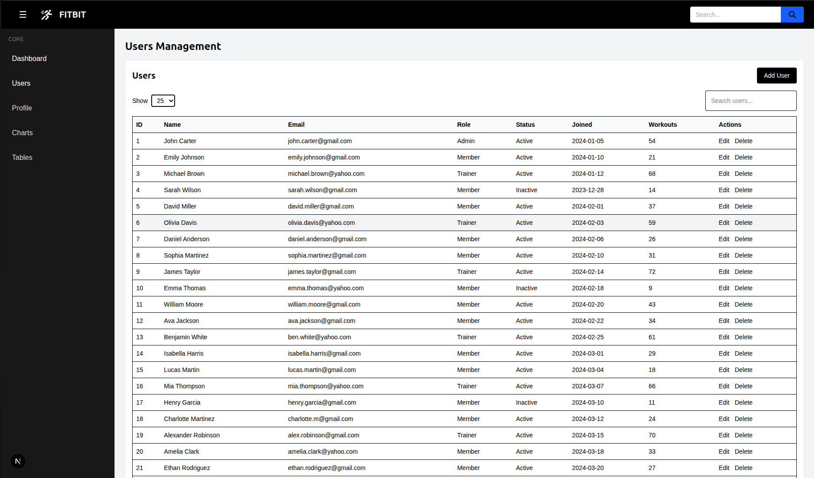
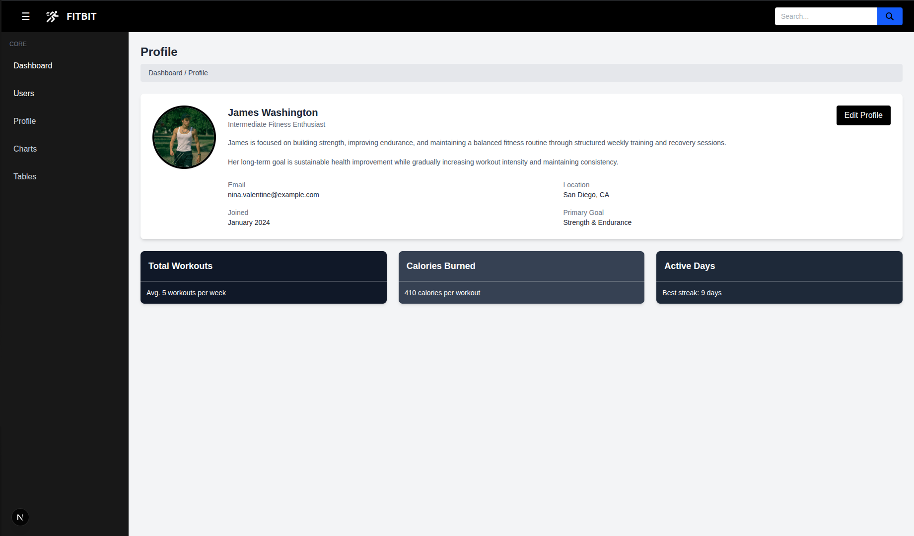
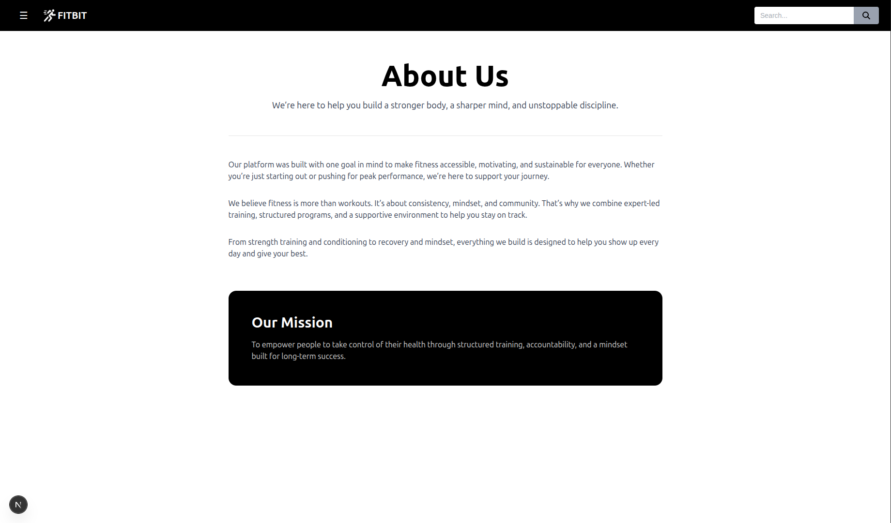

## Week 3 (Day 5) - Capstone Mini Project (No backend)

**Name: Love Dewangan**  
**Email: love.dewangan@hestabit.in**

## Task

Build a Full Multi-Page UI in Next.js + Tailwind, no backend

## Final Output


## Folder Structure

```text
Week 3 Advance Frontend/
├── public/
├── src/
│ ├── app/
│ │ ├── about/
│ │ │ └── page.jsx
│ │ ├── dashboard/
│ │ │ ├── profile/
│ │ │ │ └── page.jsx
│ │ │ ├── users/
│ │ │ ├── layout.jsx
│ │ │ └── page.jsx
│ │ ├── globals.css
│ │ ├── layout.jsx
│ │ └── page.jsx
│ ├── components/
│ │ ├── ui/
│ │ │ ├── Button.jsx
│ │ │ ├── Card.jsx
│ │ │ ├── Footer.jsx
│ │ │ ├── Input.jsx
│ │ │ ├── Login.jsx
│ │ │ ├── Modal.jsx
│ │ │ ├── Navbar_Home.jsx
│ │ │ ├── Navbar.jsx
│ │ │ ├── Sidebar.jsx
│ │ │ ├── Testimonial.jsx
│ │ │ ├── UserListing.jsx
│ │ │ └── LayoutClient.jsx
├── .gitignore
├── eslint.config.mjs
├── jsconfig.json
├── next.config.mjs
├── package-lock.json
├── package.json
├── postcss.config.mjs
├── README.md
├── tailwind.config.js
├── Day 1 Tailwind and UI System Basics/
├── Day 2 Tailwind Advanced and Component Library/
├── Day 3 Next.js Routing and Layout System/
├── Day 4 Dynamic UI and Image Optimization/
└── Day 5 Capstone Mini Project/
```

## Components List

Button
Card
Footer
Input
Login
Modal
Navbar_Home
Navbar
Sidebar
Testimonial
UserListing
LayoutClient

## Lesson Learned

**Next.js**
Learned many things about this framework in throughout this week few important things I would like to point out which I used in my project are:

**- Routing** which make are job easier as going from one page to another is way easier through routing as Next.js supports file based routing system which automatically maps URLs. Also I used Static and Nested Routes in my project which help me alot.

**- Server Side Rendering** this optimize the webpage I could see the difference as previously working in HTML CSS JS. Here I understood that the HTML of a page is generated in the server and then sent to browser.

**- Components** are the integral part of React based application as it works as building blocks which are reusable also it contains HTML and JSX and Javascript logic of a UI element. These components allowed me to manage my code and File Structure well. Additionally components avoided the extra lines of code.

**Tailwind CSS**
Learned many things about this CSS framework which is a utility first CSS which is easier than CSS syntax wise. Here we didnt need to maintain specificity of the tags. No Ids, className required to work on HTML styling.

## Landing Page


## Learning and Outcomes

**Login Page**
Here for the login page I tried to make a Modal where when we click Sign Up button then a modal window pops out and I have applied a translucent glassy background to it so that the backdrop is visible.


**Dashboard**
For Dashboard I have used multiple components of the project like Navbar, Sidebar, Button, Cards where I accumulated them all to make the dashboard structure.


**Users Listing**
For UserList I generated multiple dummy data and added them in a HTML table elements like <table> <thead> <tbody> etc. Also I have added search feature by creating a Search state with filtering the target value.


**Profile page**


**About page**

