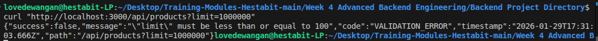
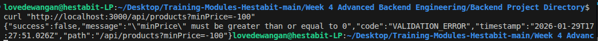
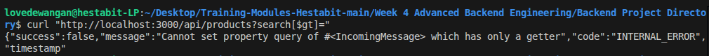
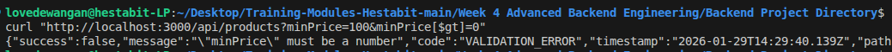
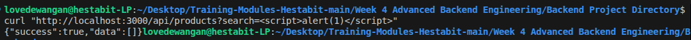
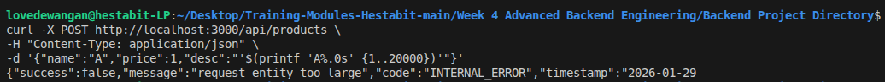
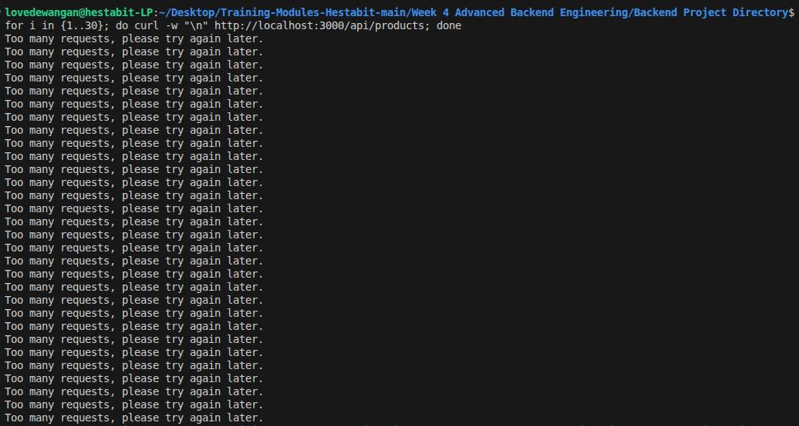
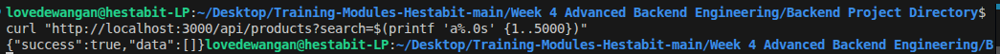

## Week 4 (Day 4) - Security, Validation, Rate Limiting and Hardening

**Name: Love Dewangan**  
**Email: love.dewangan@hestabit.in**

## Task

Security Controls Implemented

- Validation using JOI and Zod
- Prevention of NoSQL Injection, XSS, Parameter pollution.
- CORS policy enforcement
- Global rate limiting using express-rate-limit
- Payload size limiting via express.json({ limit })

## Security Report

**Extreme Query Values**

**Threat:** Abuse of pagination parameters causing memory exhaustion or performance degradation.

**Test:**
GET /api/products?limit=1000000

**Negative Numeric Parameters**

**Threat:** Bypassing logic with invalid numeric values.

**Test:**
GET /api/products?minPrice=-100

**NoSQL Injection**

**Threat:** Manipulating MongoDB queries using injected operators.

**Test:**
GET /api/products?search[$gt]=

**HTTP Parameter Pollution**

**Threat:** Supplying the same query parameter multiple times to bypass validation.

**Test:**
GET /api/products?minPrice=100&minPrice=0

**Cross-Site Scripting (XSS)**

**Threat:** Injection of executable scripts into stored or reflected responses.

**Test:**
GET /api/products?search=

**Payload Size Abuse**

**Threat:** Large request bodies causing memory exhaustion (DoS).

**Test:**
POST /api/products with description > payload size limit

**Rate Limiting**

**Threat:** Brute-force or denial-of-service via rapid repeated requests.

**Test:**
30 rapid consecutive requests to GET /api/products

**Regular Expression Safety**

**Threat:** ReDoS attacks via catastrophic backtracking.

**Test:**
GET /api/products?search=AAAA...(5000 chars)

