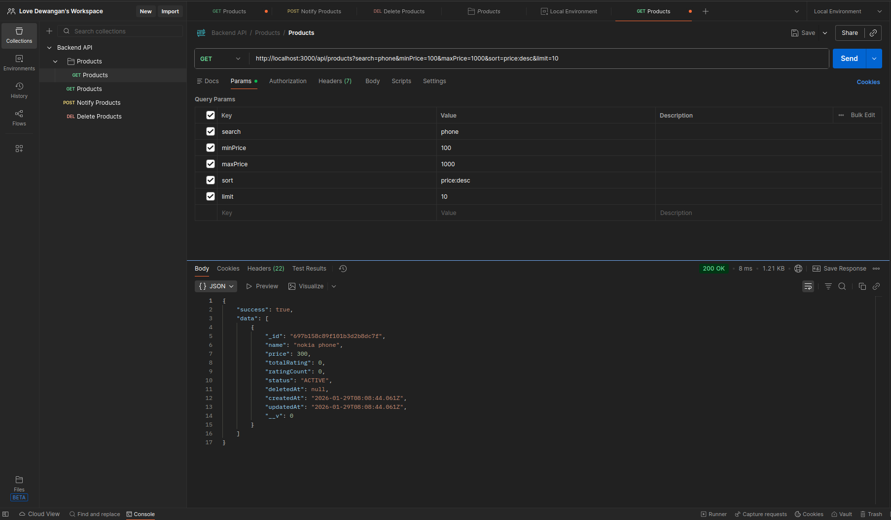
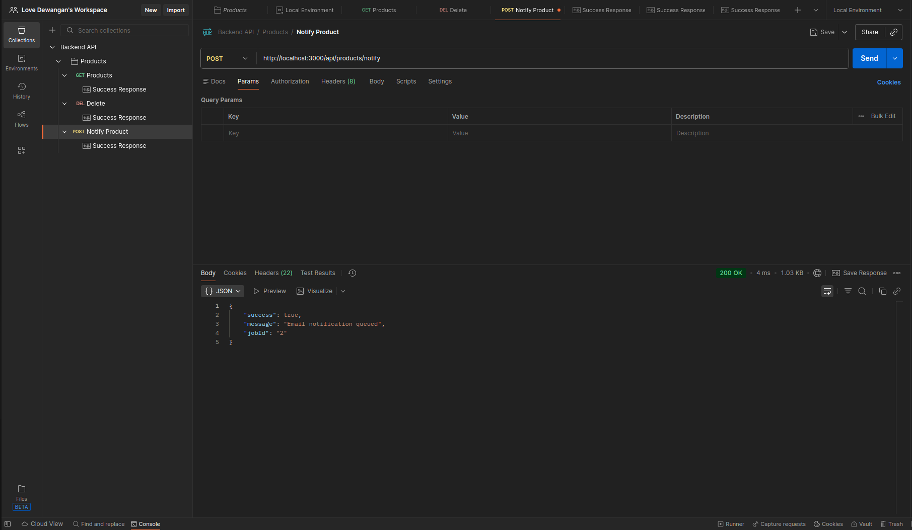
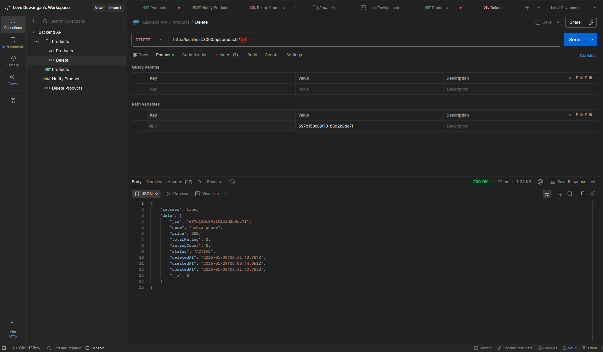

## Week 4 (Day 5) - Security, Validation, Rate Limiting and Hardening

**Name: Love Dewangan**  
**Email: love.dewangan@hestabit.in**

## Task

To Implement Background Job like email notification, Request Tracing, API testing through Postman, also a Deploy Ready Folder.

# Deployment Notes

These instructions tells how to run and deploy the Backend API.

## Requirements

- Node.js
- MongoDB
- Redis
- Express
- PM2

## Environment Configuration

The application uses environment variables for configuration.

**Create Environment File** 
.env.local 

**Update the .env.local accordingly** 
PORT=3000
DATABASE_URL=mongodb://localhost:27017/app_local
REDIS_URL=redis://127.0.0.1:6379
NODE_ENV=local

**Start the Services that are Required for the API**

**MongoDB -** 
`mongod`

**Redis** 
When you install redis the redis server start automatically.

`sudo systemctl start redis-server`

**Start the backend server** 

`NODE_ENV=local node src/index.js`

**Background Jobs using BullMQ** 

- Background jobs are handled using BullMQ
- Redis is required for job processing

To manually trigger a background job: 

`curl -X POST http://localhost:3000/api/products/notify`

**API Testing via Postman**

- Open Postman
- Import the collection file:
  `Backend API.postman_collection.json`
- Create a Postman environment with URL:
  `http://localhost:3000`
- Now start testing the APIs using GET, POST, DELETE(SoftDelete for this API).

GET -

POST -

DELETE -

**Production Deployment (PM2)**
For production, PM2 is used as a process manager.

**Start the application with PM2:**

`pm2 start prod/ecosystem.config.js`

**Check running processes**

`pm2 list`

**View logs**

`pm2 logs`

### Ensure after performing this Stop the Services

**Stop Application (PM2)**

`pm2 stop backend-api`
`pm2 delete backend-api`

**Stop Redis (Service)**

`sudo systemctl stop redis-server`

**Stop MongoDB (Service)**

`sudo systemctl stop mongod`
