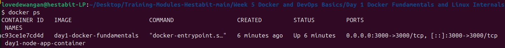
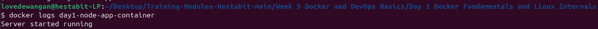
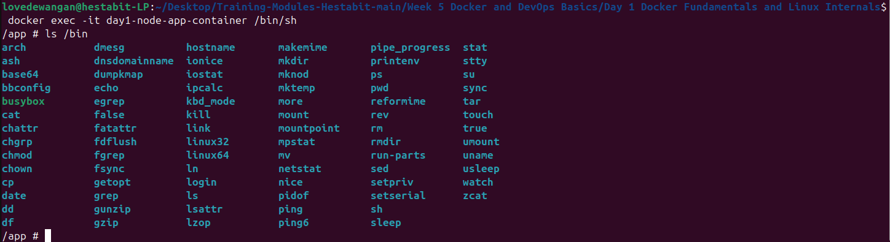
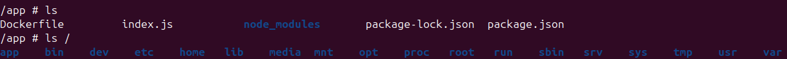
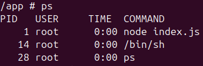
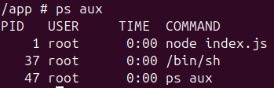
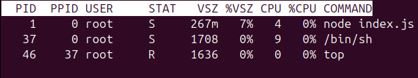
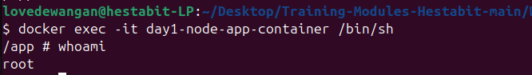
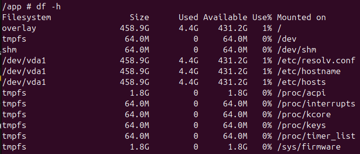

# Week 5 (Day 1) - Server Side Foundations with Docker & DevOps Basics

**Name: Love Dewangan**  
**Email: love.dewangan@hestabit.in**

## Task

Learn docker fundamentals and commands. Create a docker image, container then perform troubleshoot operation.

## Image and Container

## TroubleShoot commands

To view the logs produced by a container

To run command inside already running container

## Filesystem Commands

This are used to navigate and inspect directories

### ls 

### Processes Commands

To check whats running right now and how much resource is it using. Also docker has fewer processes compared to a Virtual Machine

### ps 

### ps aux 

### top 

## Users and Permissions

### whoami 

## Disk and Storage

