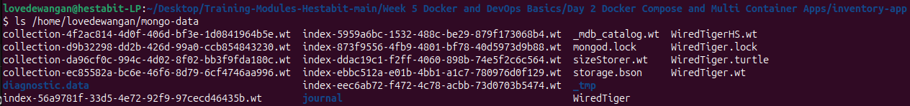
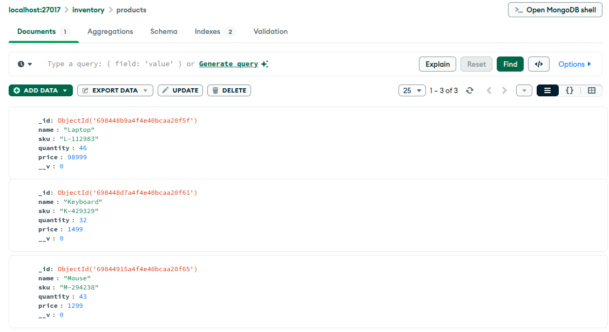
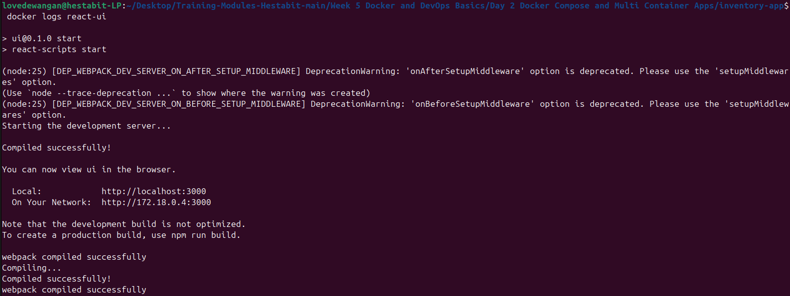
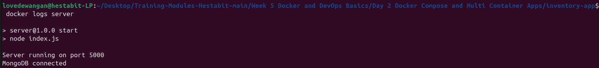
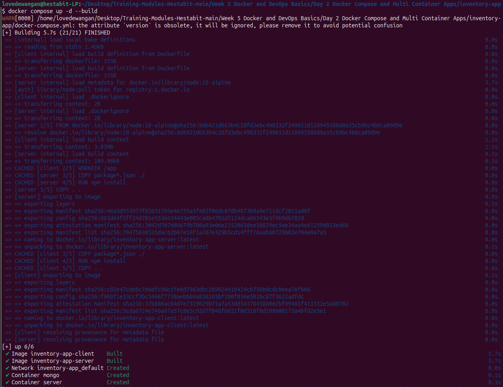
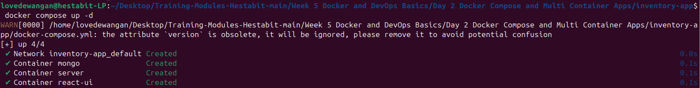

# Week 5 (Day 1) - Server Side Foundations with Docker & DevOps Basics

**Name: Love Dewangan**  
**Email: love.dewangan@hestabit.in**

## Task

To Deploy a Application build in React + Node + MongoDB in docker through compose using .yml file, where we had to ensure server connects Mongo via container networking.

## Architecture

### Overview

This application consists of three integral services managed using Docker Compose(.yml):

- React (For Client)
- Node.js (For Server)
- MongoDB (For Database)

### Networking

Docker Compose creates a Shared bridge network through which different services in the application communicate:

- Client -> Server -> Mongo

### Data Persistence

For Data persistence of MongoDB I used Docker Volume to persist data across container when container restarts. I persisted Data locally in the host.

### Data Storage

### Logging

All services has logs for ensuring everything runs perfectly and troubleshooting if required.

- Client Logs
  

- Server Logs
  

### Startup & Building

The entire application started using the single command as mentioned:

- Building Images
  

- Start Application
  
