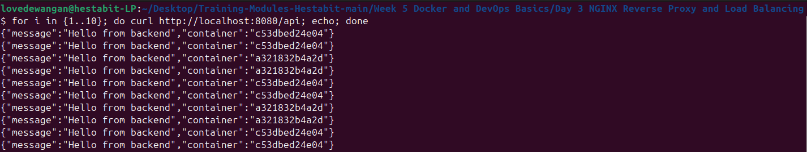

# Week 5 (Day 3) - NGINX Reverse Proxy and Load Balancing

**Name: Love Dewangan**  
**Email: love.dewangan@hestabit.in**

## Task

To run two instances of backend and load balancing using NGINX container as reverse proxy

## Architecture

Client

- NGINX (Reverse Proxy & Load Balancer)
- Backend Service (multiple containers on port 3000)

Only NGINX is exposed to the Internet, it works as a middleman server.

## Services

### NGINX

- For reverse proxy
- For load balancer

### Backend (Node and Express)

- A simple backend server

## NGINX Configuration

- NGINX acts as a middle layer between user and the backend servers.
- The requests are shared between multiple backend containers to keep the system balanced and responsive.

## How to Run

- Build and start containers:

```
docker compose up --build
```

- Test the reverse proxy:

```
curl http://localhost:8080/api
```

- Run the request multiple times to observe load balancing or Just run this.

```
for i in {1..10}; do curl http://localhost:8080/api; echo; done
```


