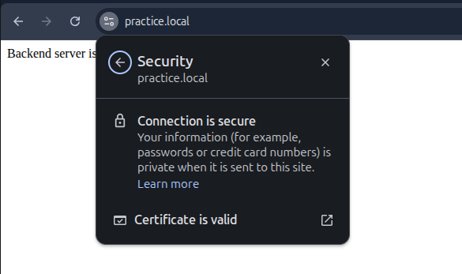
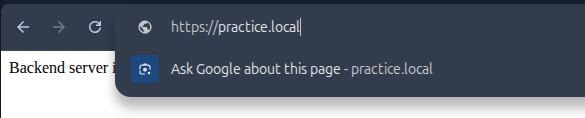

# Week 5 (Day 4) - SSL, Self signed, mkcert and HTTPS

**Name: Love Dewangan**  
**Email: love.dewangan@hestabit.in**

## Task

To Generate a self signed certifcate using mkcert for locally trusted TLS certificates.

## Workflow Overview

```
                   Browser
                      |
                    HTTPS
                      |
              NGINX (SSL termination)
                      |
                    HTTP
                      |
                Node.js Server
```

## Preinstalled Services

- Docker & Docker Compose installed
- mkcert installed
- Local domain mapped via /etc/hosts

## Step 1: Install mkcert and Local CA

```
sudo apt install libnss3-tools mkcert
mkcert -install
```

This will install a local Certificate Authority trusted by the browser.

## Step 2: Configure Local Domain

Edit /etc/hosts:

```bash
127.0.0.1 practice.local
```

## Step 3: Generate SSL Certificates

```bash
mkcert practice.local localhost 127.0.0.1
```

## Step 4: NGINX HTTPS Configuration

nginx/default.conf

Setting up HTTPS server

```
server {
    listen 443 ssl;
    server_name practice.local;

    ssl_certificate /etc/nginx/certs/practice.local.pem;
    ssl_certificate_key /etc/nginx/certs/practice.local-key.pem;

    location / {
        proxy_pass http://server:5000;
        proxy_set_header Host $host;
        proxy_set_header X-Forwarded-Proto https;
    }
}
```

## Step 5: Add a temporary Backend Server (Node.js)

## Step 6: Docker Compose Configuration

docker-compose.yml

Make sure apart from server NGINX should look like this.

```
nginx:
    image: nginx:alpine
    container_name: nginx
    ports:
      - "80:80"
      - "443:443"
    volumes:
      - ./nginx/default.conf:/etc/nginx/conf.d/default.conf
      - ./nginx/certs:/etc/nginx/certs
    depends_on:
      - server
```

## Step 7: Run Containers

```bash
docker compose up --build -d
```

## Step 8: Verification

Open browser:

```
https://practice.local
```



HTTP -> HTTPS

