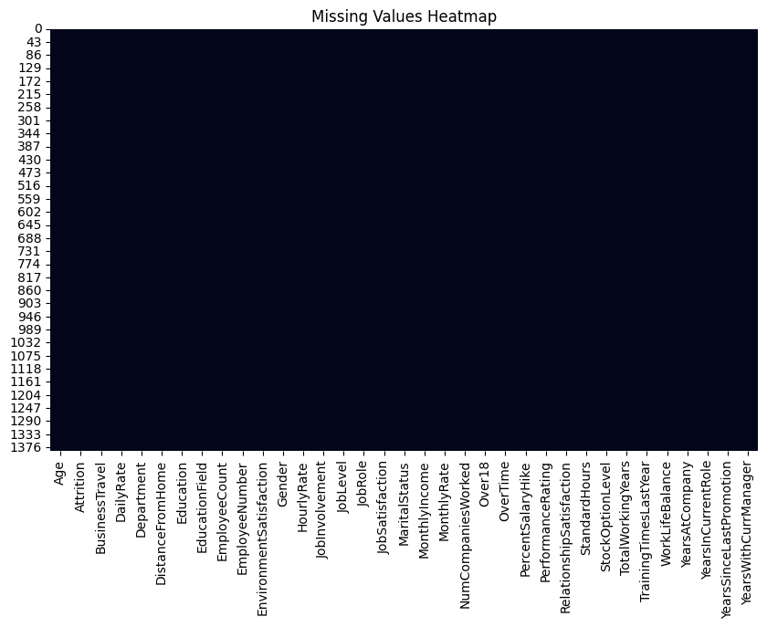
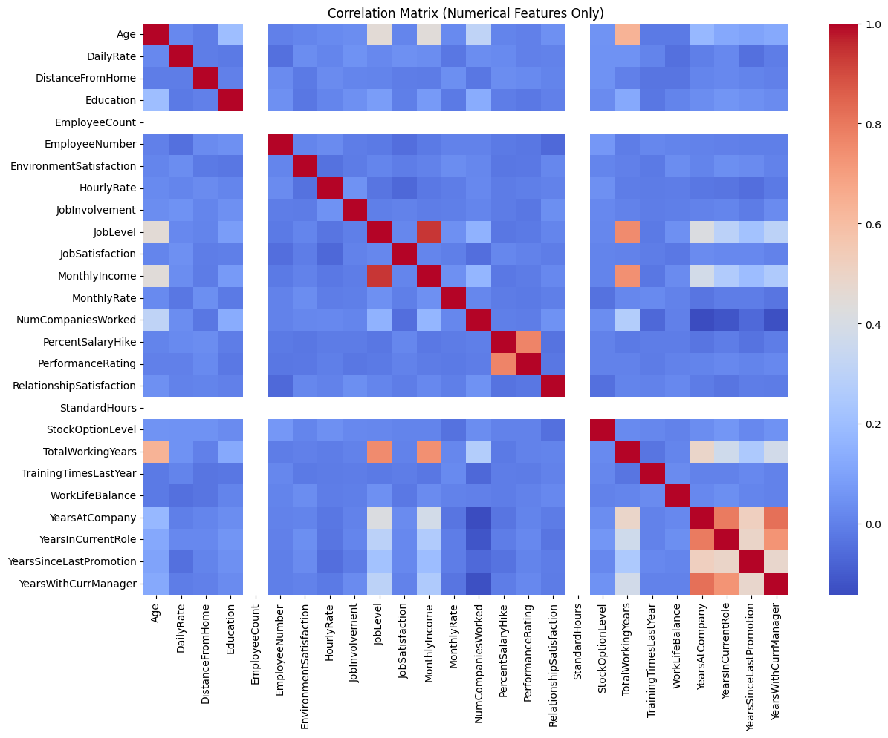
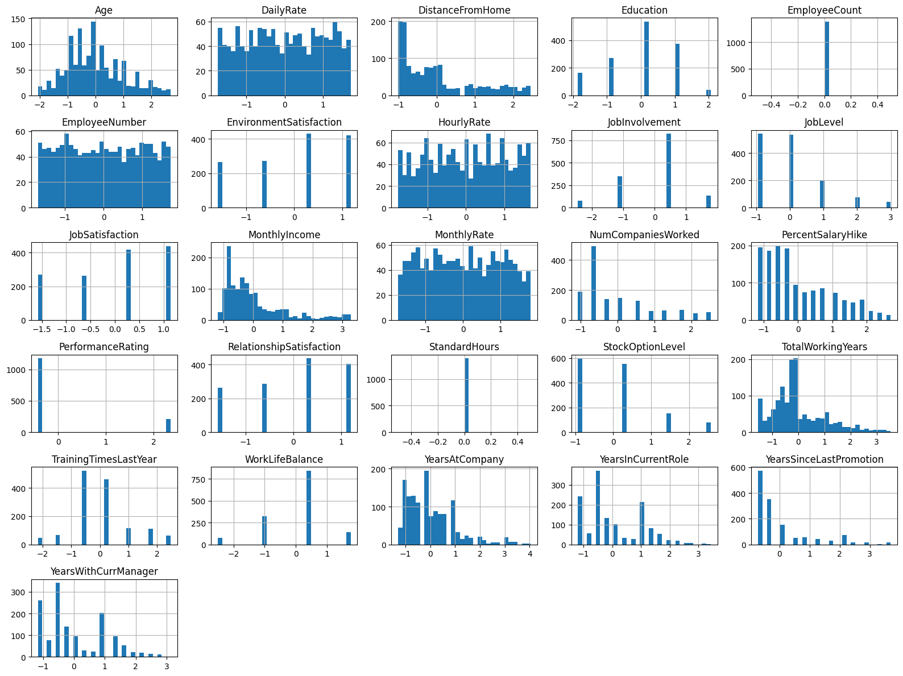
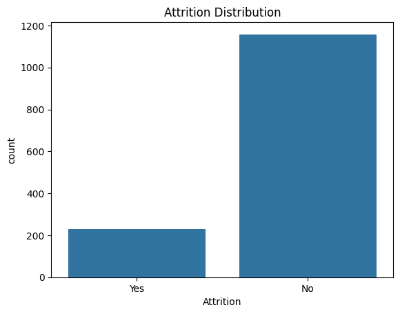

# Week 6 (Day 1) - Data Pipeline, Exploratory Data Analysis and Project Architecture

**Name: Love Dewangan**  
**Email: love.dewangan@hestabit.in**

## Task

The objective was to make a professional ML project architecture, build a reproducible data preprocessing pipeline, and perform Exploratory Data Analysis (EDA) on the dataset.

## Dataset Description

**Dataset Name:** HR Employee Attrition Dataset  
**Source:** Kaggle

## Project Folder Structure

The following mandatory folder structure was created and used:

```
src/
├── data/
│   ├── raw/          # Original, immutable dataset
│   ├── processed/    # Cleaned and transformed dataset
│   └── external/
├── notebooks/        # EDA notebooks
├── pipelines/        # Data processing scripts
├── features/
├── models/
├── training/
├── evaluation/
├── deployment/
├── monitoring/
├── utils/
├── config/
└── logs/
```

This structure ensures scalability, reproducibility, and clarity across the ML lifecycle.

## Data Pipeline Summary

The data pipeline was implemented in:

```
src/pipelines/data_pipeline.py
```

### Pipeline Steps

1. **Data Loading**
   - Dataset loaded from `src/data/raw`
   - Shape verified before processing

2. **Missing Value Handling**
   - Numerical features: filled using **median**
   - Categorical features: filled using **mode**
   - Verified using missing-value heatmap

3. **Duplicate Removal**
   - Exact duplicate rows removed to avoid data leakage

4. **Outlier Detection & Removal**
   - Method used: **Z-score**
   - Applied **only to continuous numerical features**:
     - Age
     - MonthlyIncome
     - DistanceFromHome
     - TotalWorkingYears
     - YearsAtCompany
     - YearsInCurrentRole
     - YearsSinceLastPromotion
     - YearsWithCurrManager
   - Prevented removal of rows due to binary or constant columns

5. **Feature Scaling**
   - Applied **StandardScaler**
   - Scaling performed only on numerical features
   - Ensures features are comparable for future modeling

6. **Processed Data Output**
   - Clean dataset saved as:
     ```
     src/data/processed/final.csv
     ```

## Exploratory Data Analysis (EDA)

### Analyses Performed

#### 1. Missing Values Heatmap



- Visualization confirms no missing values in the cleaned dataset
- Dense heatmap indicates complete data

#### 2. Correlation Matrix



- Computed using numerical features only
- Helps identify linear relationships and multicollinearity
- Categorical features excluded at this stage (encoding deferred to Day 2)

#### 3. Feature Distributions



- Histograms plotted for all numerical features
- Revealed skewness in income-related and experience-related features
- Useful for future transformations if required

#### 4. Target Variable Distribution



- Attrition distribution shows class imbalance
- Important insight for future steps (SMOTE / class weights)
