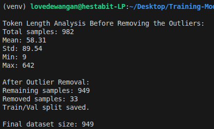
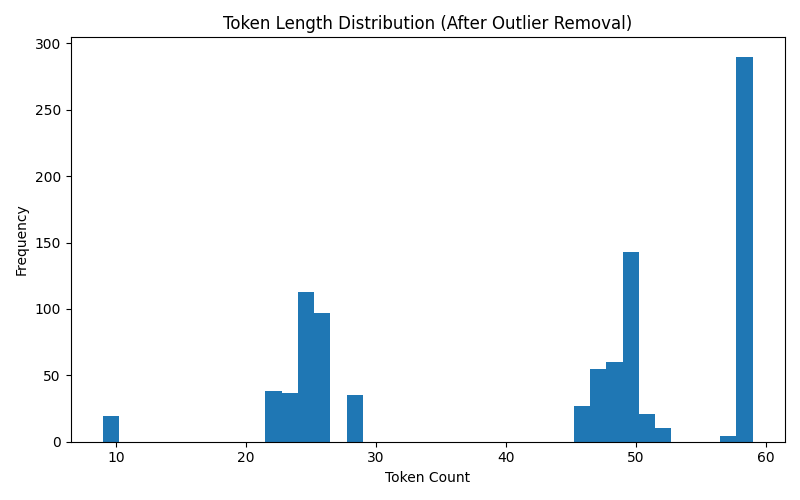

# Week 8 (Day 1) - LLM Architecture and Data Prep for Fine Tuning

**Name: Love Dewangan**  
**Email: love.dewangan@hestabit.in**

## Task

To build a Instruction Tuning Dataser that must include QA, Reasoning and Extraction also to run Token Length Analysis on the data set also to generate the Distribution graph after removing outliers.

## Overview

For this I generated a Dataset in:

- Domain: Finance
- Generated Samples: 1000
- Samples After Initial Cleaning: 982
- Final Dataset Size After Outlier Removal: 949
- Train/Validation Split: 80/20

## Token Length Analysis (Before Outlier Removal)

- Total Samples: 982
- Mean Token Length: 58.31
- Standard Deviation: 89.54
- Minimum Token Length: 9
- Maximum Token Length: 642

I intentionally included outliers to check whether data cleaner is able to remove it or not.

## Results:

## Distribution Graph

## Final Deliverables

- src/data/train.jsonl\
- src/data/val.jsonl\
- src/data/token_distribution_after.png\
- DATASET-ANALYSIS.md
